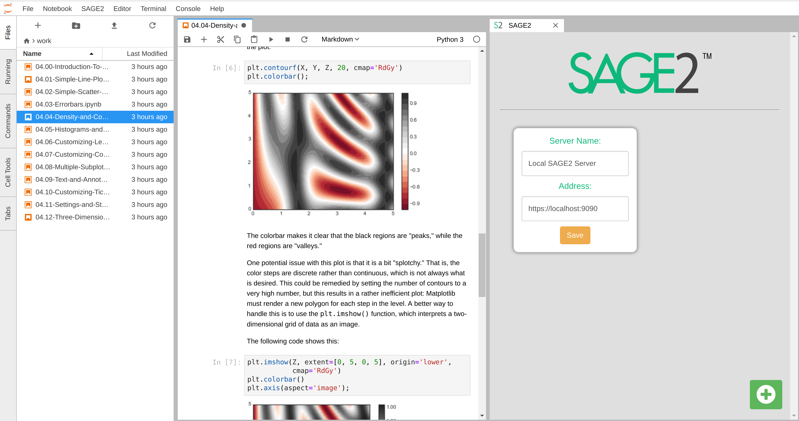

# jupyterlab_sage2

A JupyterLab extension to integrate SAGE2 into the JupyterLab scientific workflow.

 *Three researchers using JupyterLab and SAGE2 together with the jupyterlab_sage2 extension.*

## Extension

The goal of this extension is to use [SAGE2](http://sage2.sagecommons.org/) with [JupyterLab](https://github.com/jupyterlab) to integrate existing data science workflows into the collaborative software.

### *Disclaimer: A SAGE2 server must be running version `2.0.327` or newer to use this JupyterLab functionality.*

This extension to JupyterLab allows a user to simultaneously connect to multiple SAGE2 servers and share JupyterLab content with SAGE2, including:
* Notebooks
* Notebook Cells (Images)

From the JupyterLab launcher, open the SAGE2 widget under "Other." Once the SAGE2 Widget is opened, a server connection can be created by clicking the green '+' button and entering the server Address. A Server Name can be specified in order to more easily refer to a server later.



The plugin displays current server connections -- these connections are persistent whether or not the widget is open. The gold star indicates a 'favorite' SAGE2 server, or a server which you will be using more frequently.


When a Notebook is open, the Notebook or a selected cell output may be sent to SAGE2 through the main menu. Sending a Cell/Notebook to 'Favorite' sends the content to the Favorited server, while sending content to '...' opens a dialog in which a user may choose one of the SAGE2 connections to send to.


Notebooks are sent to SAGE2 and rendered using [nbviewer](http://nbviewer.jupyter.org/). Notebook cells are rendered as images and automatically updated when a cell is re-run.
This requires that the SAGE2 server has an externally accessible IP or hostname which nbviewer can access. 

<!-- ### How-to

Click the Green-Plus-Button to create a new server connection, and enter a server name and address.

Once connected, use the SAGE2 menu in the upper menu-bar to send the current notebook or selected cell output to a connected SAGE2 server of your choice. -->

## Package Installation

### Prerequisites

* **JupyterLab**

### Installation

```bash
jupyter labextension install jupyterlab_sage2
```

### Development

For a development install (requires `npm` version 4 or later), do the following in the repository directory:

```bash
npm install
npm run build
jupyter labextension install .
```

To rebuild the package and the JupyterLab app:

```bash
jupyter lab build
```

## Docker Installation

To try JupyterLab with SAGE2, use the `sage2/jupyterlab-datascience-notebook` Docker image. This image is built `FROM` the `jupyter/datascience-notebook` and includes Python 3, R, and Julia as well as a variety of data science packages. 

### To install/update:
```
docker pull sage2/jupyterlab-datascience-notebook
```

### To run:
```
docker run -it --rm -p 8888:8888 sage2/jupyterlab-datascience-notebook:latest start.sh jupyter lab
```

The `-p 8888:8888` maps the external port to the docker port: `-p external:internal`. If you would like to select a different port to access Jupyterlab use `-p yourport:8888`.

When starting the docker image, the console will give a JupyterLab url with an access token. To access JupyterLab, navigate your webpage to `http://yourhostname:yourport/?token=yourtoken`.

For more information on the jupyter/datascience-notebook Docker image, visit: https://github.com/jupyter/docker-stacks/tree/master/datascience-notebook

## Future Plans

In the future, we plan to support more content types and methods of sending data from JupyterLab to SAGE2, as well as implement a file browser for JupyterLab which allows access to SAGE2 files in the JupyterLab workspace.

## Issues and Contributing
Please direct any issues or bug reports to the repository's [Issues](https://github.com/AndrewTBurks/jupyterlab_sage2/issues).

If you would like to contribute, submit a [Pull Request](https://github.com/AndrewTBurks/jupyterlab_sage2/pulls).
