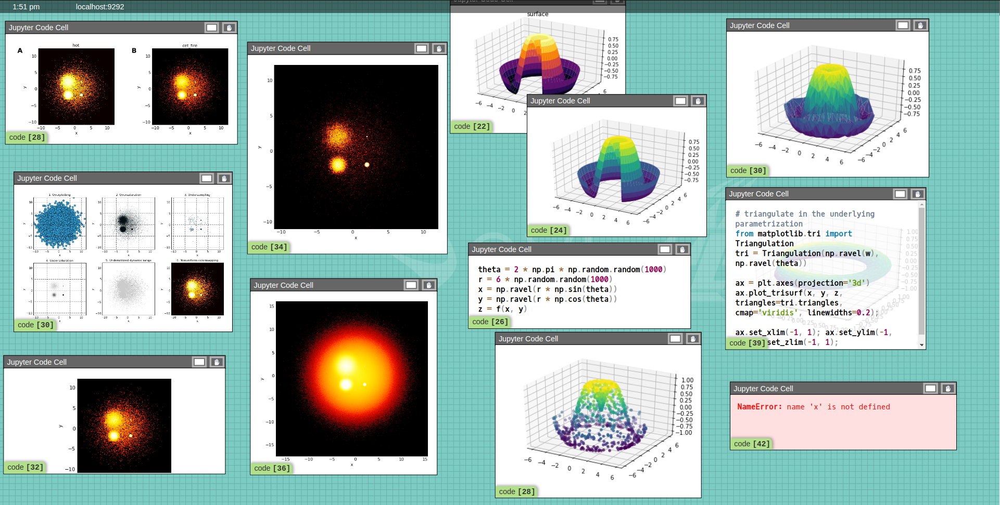

# jupyterlab_sage2

[](https://npm.im/jupyterlab_sage2)
[](https://github.com/AndrewTBurks/jupyterlab_sage2)

[
](https://hub.docker.com/r/sage2/jupyterlab-datascience-notebook)

A JupyterLab extension to integrate SAGE2 into the JupyterLab scientific workflow.

 *Three researchers using JupyterLab and SAGE2 together with the jupyterlab_sage2 extension.*

## Table of Contents
1. [Extension](#extension)
    * [Connecting to SAGE2](#connecting-to-sage2-from-jupyterlab)
    * [Supported Notebook Content](#supported-jupyter-notebook-content)
    * [Sending Content to SAGE2](#sending-notebook-content-to-sage2)
    * [Managing Shared Content](#managing-shared-content)
2. [Package Installation](#package-installation)
2. [Docker Installation](#docker-installation)
2. [Issues and Contributing](#issues-and-contributing)


## Extension

The goal of this extension is to use [SAGE2](http://sage2.sagecommons.org/) with [JupyterLab](https://github.com/jupyterlab) to integrate existing data science workflows into the collaborative software.

### ***Disclaimer**: A SAGE2 server must be running version `5.0.0` or newer to use all current JupyterLab functionality.*

This extension to JupyterLab allows a user to simultaneously connect to multiple SAGE2 servers and share JupyterLab content with SAGE2, including:
- __Single Cells__ from a Notebook
- An `.ipynb` __Notebook File__
- __All Cells__ in a Notebook by either:
  - __Code Cells Only__ _or ..._
  - __Code and Markdown Cells__

### Connecting to SAGE2 from JupyterLab

From the JupyterLab launcher, open the SAGE2 widget under "Other." Once the SAGE2 Widget is opened, a server connection can be created by clicking the green '+' button and entering the server Address. A Server Name can be specified in order to more easily refer to a server later.


The plugin displays current server connections -- these connections are persistent whether or not the widget is open. The gold Star icon allows a user to choose a 'favorite' SAGE2 server which they may send content to more often.


_Two SAGE2 Connections. **Left**: A SAGE2 connection which is closed (server turned off, incorrect IP, firewall issue). **Right**: A successful SAGE2 server connection._

### Supported Jupyter Notebook Content

SAGE2 and this JupyterLab Plugin supports a variety of cell content, seen below. In order to best replicate the content in Jupyter Notebooks, SAGE2 will render:

- `image`, `html`, and `text` cell __Output__
- __Errors__ produced by cells
- __Code Display__ (a toggleable overlaid on cells with output)


_Code Cells shared to SAGE2. These include `html` and `image` output, an Error message, and a few enabled Code Overlays._

### Sending Notebook Content to SAGE2

<!-- # ***TODO: REVISE*** -->

To select a Notebook from which to send content, simply open the notebook in JupyterLab. With a Notebook active, open the SAGE2 menu in the Menu Bar (pictured below) to choose the content to share.

Sending a Content to '**★**' sends the content to the Favorited server, while sending content to '...' opens a dialog in which a user may choose one of the SAGE2 connections to send to.


Notebooks are sent to SAGE2 and rendered using [nbviewer](http://nbviewer.jupyter.org/). This requires that the SAGE2 server has an externally accessible IP or hostname which nbviewer can access. Notebook cells are rendered as images and automatically updated when a cell is re-run.

### Managing Shared Content

There are two methods of managing content shared from JupyterLab to SAGE2. First, you can simply close apps from within the SAGE2 UI and cell updates will no longer be sent. This allows you to remove content based on what you currently **see** on the display. This UI can be accessed by clicking on the URL displayed for a SAGE2 Connection in JupyterLab.

Alternatively, you may use the **Shared Content** pane within the plugin. This interface displays all **Notebooks** with shared content. Upon selecting a notebook, the individual cells currently shared are also displayed. You may remove a single cell at a time or all cells from the notebook. This allows you to manage content based on **from where** the content originated.


## Package Installation

### *Note: This package versioning mirrors that of JupyterLab. If you are not using our provided Docker images, we recommend matching your version of JupyterLab with the version of this plugin for best results.*

### Prerequisites

* **JupyterLab**

### Installation

```bash
jupyter labextension install jupyterlab_sage2
```

## Docker Installation

To try JupyterLab with SAGE2, use the `sage2/jupyterlab-datascience-notebook` Docker image. This image is built `FROM` the `jupyter/datascience-notebook` and includes Python 3, R, and Julia as well as a variety of data science packages. 

### To install/update:
```
docker pull sage2/jupyterlab-datascience-notebook
```

### To run:
```
docker run -it --rm -p 8888:8888 sage2/jupyterlab-datascience-notebook:latest start.sh jupyter lab
```

The `-p 8888:8888` maps the external port to the docker port: `-p <external>:<internal>`. If you would like to select a different port to access Jupyterlab use `-p <yourport>:8888`.

When starting the docker image, the console will give a JupyterLab url with an access token. To access JupyterLab, navigate your webpage to `http://<yourhostname>:<yourport>/?token=<yourtoken>`.

For more information on the jupyter/datascience-notebook Docker image, visit: https://github.com/jupyter/docker-stacks/tree/master/datascience-notebook

<!-- ## Future Plans

In the future, we plan to support more content types and methods of sending data from JupyterLab to SAGE2, as well as implement a file browser for JupyterLab which allows access to SAGE2 files in the JupyterLab workspace. -->

## Issues and Contributing
Please direct any issues or bug reports to the repository's [Issues](https://github.com/AndrewTBurks/jupyterlab_sage2/issues).

If you would like to contribute, submit a [Pull Request](https://github.com/AndrewTBurks/jupyterlab_sage2/pulls).


### Development Installation

For a development install (requires `npm` version 4 or later), do the following in the repository directory:

```bash
npm install
npm run build
jupyter labextension install .
```

To rebuild the package and the JupyterLab app:

```bash
jupyter lab build
```

To start development in `watch` mode:
```bash
# start in parallel:
yarn watch

# and
jupyter lab --watch
```